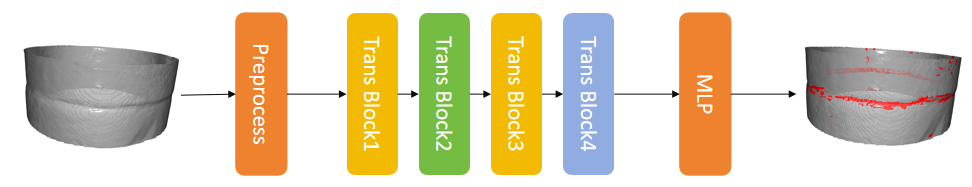

# technical documentation
## 1. Pipeline
- Model architecture: 
- Input: Point cloud
- Preprocess: Turn point cloud to tensors, with recording 3D coodinates and calculateing curvature, normals, local density.
Put these together to get a 8-length feature [3,1,3,1]. Then calculate linearity and pricipal direction as extra message.
- Transformer block: 
- Geometric-aware Attention:
- Local Attention:
- Global Attention:
## 2. Code description
### 2.1 Code tree 
. \
├── data \
├── main.py \
├── model \
│   ├── attention \
│   │   ├── anisotropic_dist.py \
│   │   ├── geom_bias.py \
│   │   ├── multi_head.py \
│   │   └── side_gate.py \
│   ├── model.py \
│   └── transformer_block.py \
├── preprocess \
│   ├── geometric_feature.py \
│   └── preprocess.py \
├── scripts \
│   ├── npz_to_ply.py \
│   ├── smoke_test.py \
│   ├── test_collate.py \
│   └── visualize_mask.py \
├── test \
│   └── test.py \
├── train \
│   ├── mask_strategy.py \
│   ├── torch_test.py \
│   └── train.py \
├── utils \
│   ├── config.py \
│   ├── io_utils.py \
│   └── metric_utils.py \
├── visualize.py \
└── weights 
### 2.2 Some functions' details
How to calculate messages in preprocess 
- normals: open3d lib, use KNN 
- curvature: use KD tree, find k neighbors, calculate covariance matrix, use its eigenvalues to get curvature 
- local density: use KD tree 
- linearity: 
- principal direction

About model

